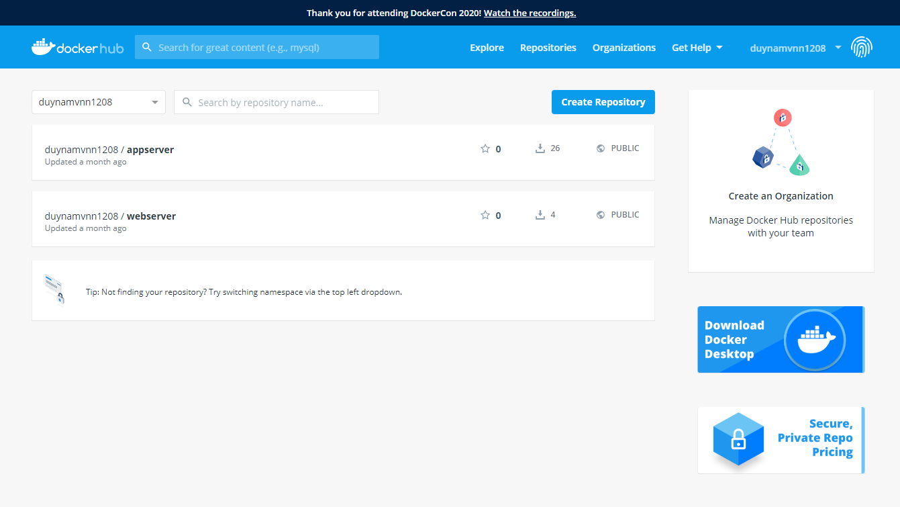
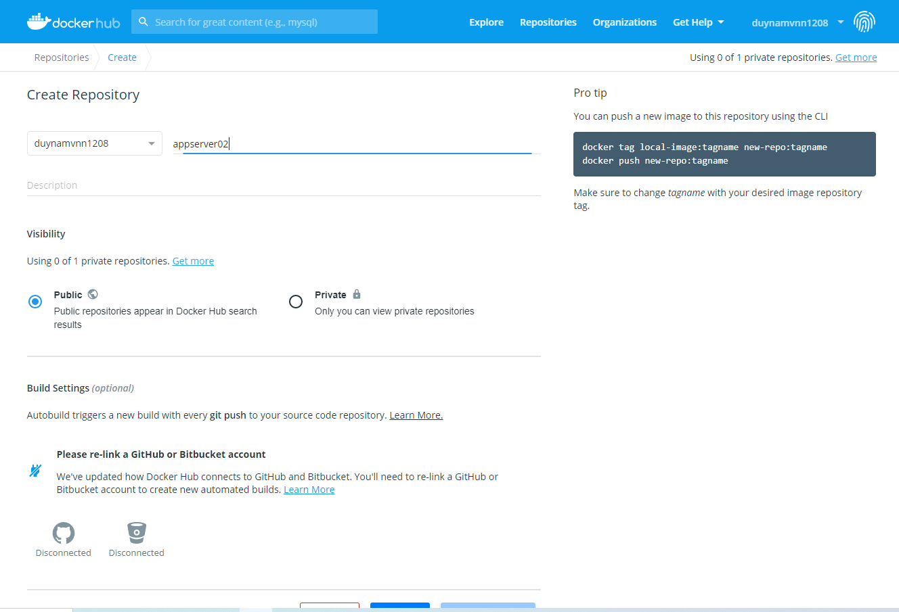

## Build docker container and up to docker-hub
- `cd appServer/`
- `docker build -t duynamvnn1208/appserver02 .`
### Craete Docker Hub Repository


- `docker push duynamvnn1208/appserver02:latest`
    ```
    [ec2-user@ip-172-31-15-114 appServer]$ docker push duynamvnn1208/appserver02:latest
    The push refers to repository [docker.io/duynamvnn1208/appserver02]
    5c5b7a6c59f3: Pushed 
    216be0c64816: Pushed 
    1aebef4f5a49: Pushed 
    6ba68369695d: Pushed 
    109988400934: Mounted from library/node 
    0cdeb35eff67: Mounted from library/node 
    312072b77e32: Mounted from library/node 
    3e207b409db3: Mounted from duynamvnn1208/appserver 
    latest: digest: sha256:18af0ff58d11868868b40c2765b50a202df844078a37663f4840cda96bbe1dc0 size: 1997
    ```
## Deploy manifest file in /manifest/manifest.yaml
## Deploy Ingress Application LoadBalancer in /manifest/ingress.yaml